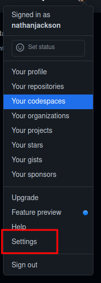
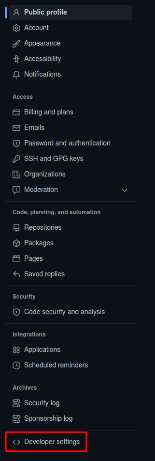
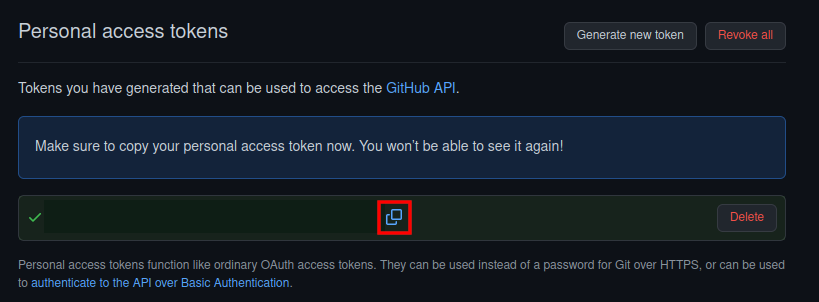
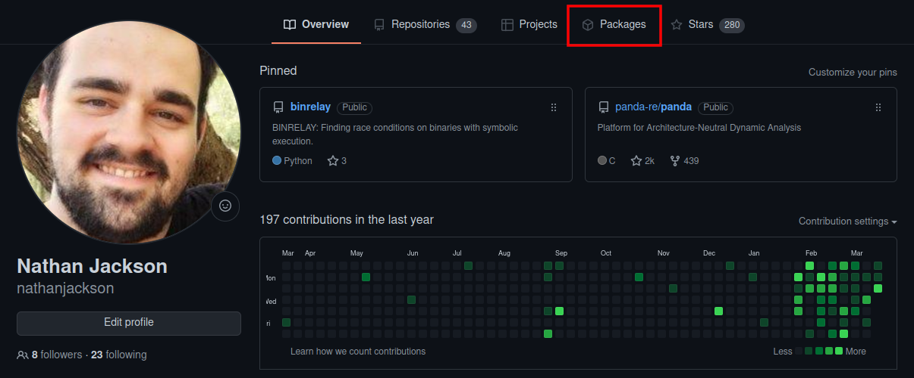
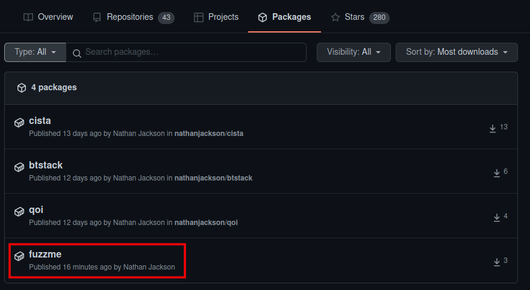
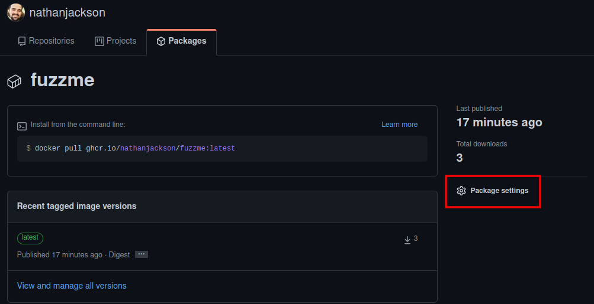
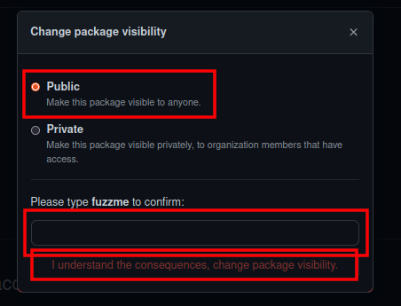

# Lab 2a. Docker Introduction

This lab will show you how to pull a Docker image, and run a new container
from that image.

1. First, pull the `hello-world` Docker image.

    You can interact with Docker on the command line using the `docker` command.

    The `docker` command has a number of sub-commands that you specify like so: `docker <subcommand>`.

    In this case, we're going to run the Docker pull sub-command which will download the `hello-world` image from Docker Hub.

    ```
    docker pull hello-world
    ```

    You should see output similar to the following:

    ```
    Using default tag: latest
    latest: Pulling from library/hello-world
    2db29710123e: Pull complete 
    Digest: sha256:6d60b42fdd5a0aa8a718b5f2eab139868bb4fa9a03c9fe1a59ed4946317c4318
    Status: Downloaded newer image for hello-world:latest
    docker.io/library/hello-world:latest
    ```

    Now the `hello-world` image is on your computer. In the next step, we'll
    actually run the application inside the image.

2. Create a new container and run it.

    To create a new container, we use the `docker run` sub-command. With `docker run`, we'll also specify `--rm`.  `--rm` tells Docker to delete the container after the program inside the container terminates. If `--rm` is left off, Docker will keep the container around after the application terminates. Unless you have a reason to keep the container around, it's generally a good idea to delete it once it's done because containers use disk space.

    ```sh
    docker run --rm hello-world
    ```

    You should see output similar to the following:

    ```
    Hello from Docker!
    This message shows that your installation appears to be working correctly.

    To generate this message, Docker took the following steps:
     1. The Docker client contacted the Docker daemon.
     2. The Docker daemon pulled the "hello-world" image from the Docker Hub.
        (amd64)
     3. The Docker daemon created a new container from that image which runs the
        executable that produces the output you are currently reading.
     4. The Docker daemon streamed that output to the Docker client, which sent it
        to your terminal.

    To try something more ambitious, you can run an Ubuntu container with:
     $ docker run -it ubuntu bash

    Share images, automate workflows, and more with a free Docker ID:
     https://hub.docker.com/

    For more examples and ideas, visit:
     https://docs.docker.com/get-started/
    ```

    Congratulations, you've just run your first container! Now in the next lab, we'll create our own image.

# Lab 2b. Build an Image and Analyze in Mayhem

This lab will show you how to build a Docker image for a toy program, push it to a Docker registry, and then use Mayhem to analyze the toy program in the image.

## Login to the GitHub Container Registry

1. First, we need to setup Docker to enable pushing new images for a later step.

2. Navigate to https://github.com.

3. Click on your user account icon to reveal a drop down menu.

    

4. Click on settings in the drop down menu.

    

5. On the left side of the settings page, select "Developer Settings."

    

6. On the developer settings page, select "Personal Access Tokens".

    

7. Click create new token.

    

8. Enter a note for the token, and check the repo, workflow, write:packages, and delete:packages scopes.

    

9. Scroll to the bottom and click "Generate New Token".

    

10. Click the copy button to copy the token to your clipboard.

    

11. Back on the command-line, we'll use the `docker login` command to login to the GitHub container registry.

    ```
    docker login -u <Your GitHub Username> ghcr.io
    ```

    When prompted for a password, paste your personal access token (PAT) that you copied in the previous step. Note the token will not echo. After pasting, press enter.

    You should see something similar to the following:

    ```
    Password: 
    WARNING! Your password will be stored unencrypted in /home/nathan/.docker/config.json.
    Configure a credential helper to remove this warning. See
    https://docs.docker.com/engine/reference/commandline/login/#credentials-store

    Login Succeeded
    ```

## Build and Push the Docker Image

Now that you've logged in to the GitHub container registry, we can build and push a Docker image.

1. Clone the hackathon-resources repo and change into the lab2b directory.

    ```
    git clone https://github.com/mayhemheroes/hackathon-resources.git
    cd hackathon-resources/lab2b/
    ```

2. List the contents of the lab2b directory.

    ```
    ls
    ```

    You should see the following:

    ```
    Dockerfile
    Mayhemfile
    fuzzme.c
    ```

3. Examine the Dockerfile.

    ```
    cat Dockerfile
    ```

    You'll see that the Dockerfile is split up into two stages: the build stage, and the package stage.

    ```Dockerfile
    # Build Stage:
    FROM ubuntu:20.04 as builder

    ## Install build dependencies.
    RUN apt-get update && \
        DEBIAN_FRONTEND=noninteractive apt-get install -y gcc
    
    ## Add Source Code
    ADD fuzzme.c /
    
    ## Build Step
    RUN gcc -g fuzzme.c -o fuzzme

    # Package Stage
    FROM ubuntu:20.04
    COPY --from=builder /fuzzme /
    ```

    The build stage is where we will actually setup our build environment and compile the code.

    The package stage copies the executable into our final image. Note that we could combine these into one stage, but our resulting docker image would be much larger. So the best practice here is to separate the build stage from the package stage.

4. Now, build the image using the `docker build` command.

   In the docker build command, we specify a tag name using `-t`. The tag tells docker the registry (`ghcr.io`), the name (`<Your GitHub Username>/fuzzme`, and the version (`latest`).

    ```
    docker build -t ghcr.io/<Your GitHub Username>/fuzzme:latest .
    ```

    In the docker build command, we specify a tag name using `-t`. The tag tells docker the registry (`ghcr.io`), the name (`<Your GitHub Username>/fuzzme`, and the version (`latest`) of the Docker image.

    The last argument `.` specifies the build context, which in this case is the current directory. This tells Docker what directory it has access to on the host during the build process.

5. Once the build completes. Push the image to the registry.

    ```
    docker push ghcr.io/<Your GitHub Username>/fuzzme:latest
    ```

6. Now, mark the package as public so Mayhem can see it:

    * Navigate to github.com/\<Your username\>

    * Click on "Packages".

        

    * In the packages tab, click on "fuzzme".

        

    * Now click "Package settings"

        

    * Under "Danger Zone" click "Change visibility"

        

    * In the Change package visibility dialog, set the visibility to public, type the name "fuzzme" to confirm, and click "I understand..."

        

## Start a Mayhem Run

Now that you've pushed your image to Mayhem, let's kick off a run.

1. Using your favorite text editor, modify the Mayhemfile. Replace <YOUR GITHUB USERNAME> with your GitHub username. Your Mayhemfile should look similar to this:

    ```yaml
    # Namespaced project name that the target belongs to
    project: nathanjackson/hackathon

    # Target name (should be unique within the project)
    target: fuzzme

    # Base image to run the binary in.
    image: ghcr.io/nathanjackson/fuzzme:latest

    # List of commands used to test the target
    cmds:

        # Command used to start the target, "@@" is the input file
        # (when "@@" is omitted Mayhem defaults to stdin inputs)
        - cmd: /fuzzme @@
    ```

2. Now kick off the run!

    ```
    mayhem run .
    ```

    You should see output similar to the following:

    ```
    Run started: hackathon/fuzzme/1
    Run URL: https://mayhem.forallsecure.com:443/nathanjackson/hackathon/fuzzme/1
    hackathon/fuzzme/1
    ```
