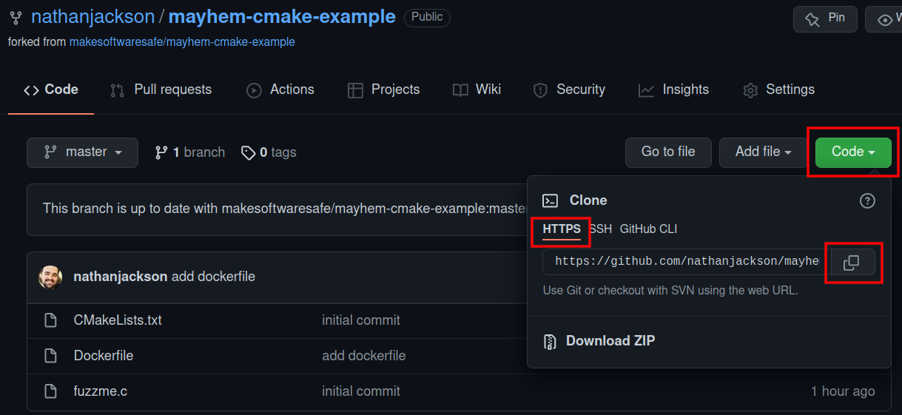
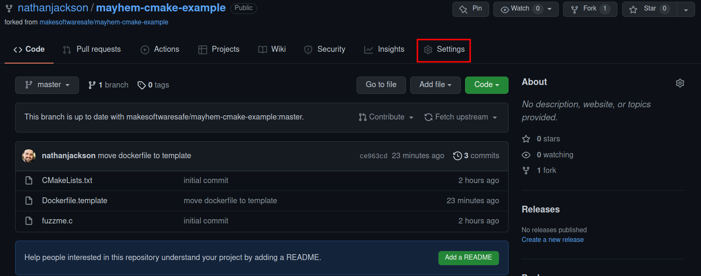
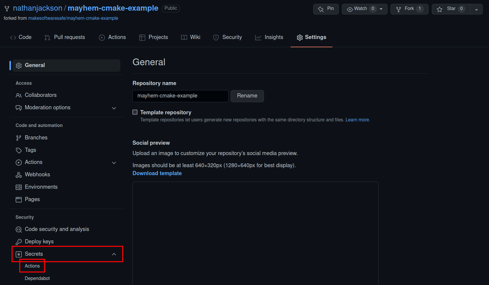
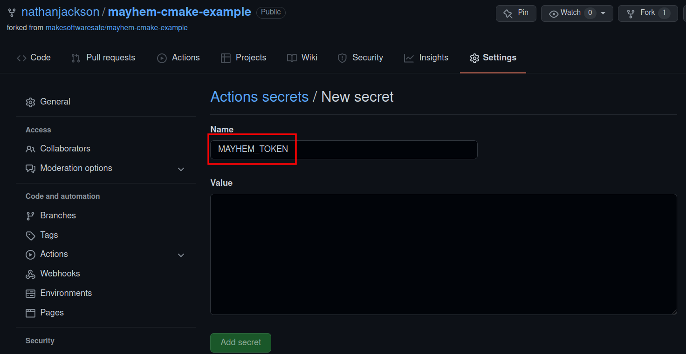
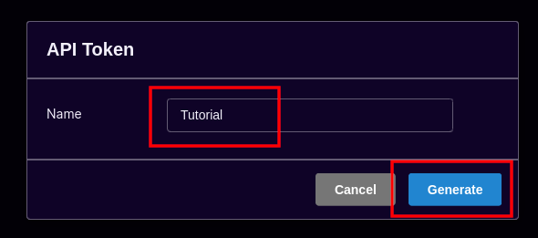
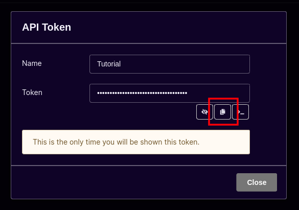
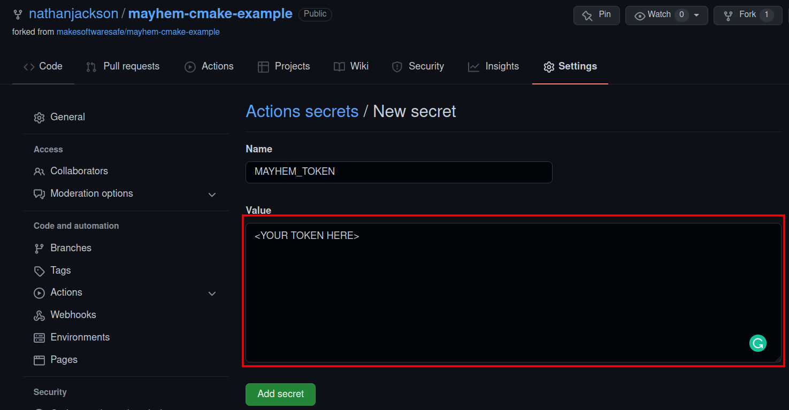
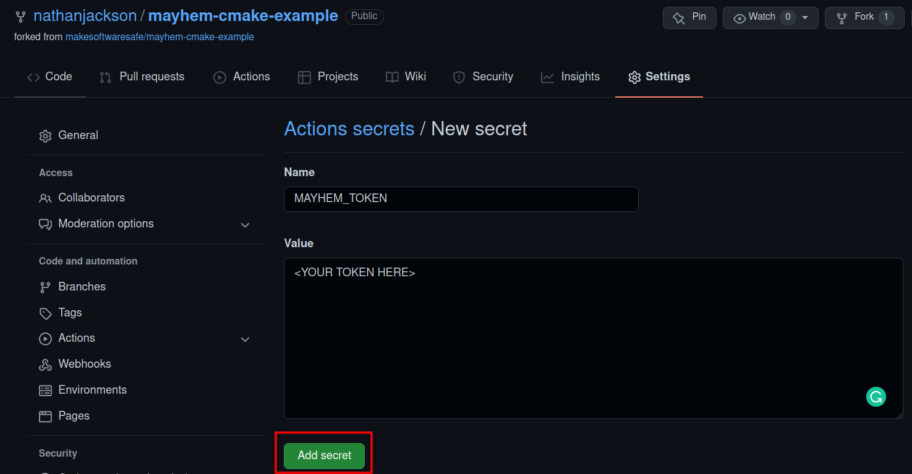
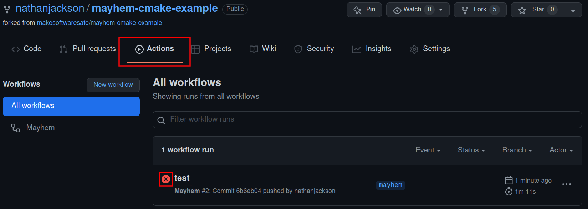
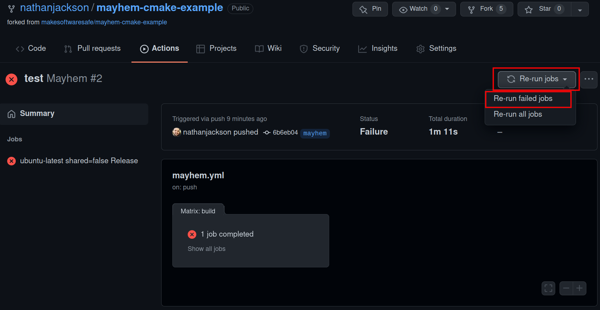

# Mayhem + GitHub Actions

In this exercise you will setup a GitHub Action that analyzes a toy project automatically everytime there is a push to the repository.

## Forking the repository

Before we begin, we first must fork the repository.

1. In your browser, navigate to https://github.com/makesoftwaresafe/mayhem-cmake-example.

2. Click "Fork" near the top of the page.

    

3. When asked where you want to create the fork, select your username.

    

Now you have your own fork of the `mayhem-cmake-example` repo. Next, we'll clone and run the toy target locally.

## Clone and Run Locally

1. Copy the HTTP Clone URL using the button that can be found on your fork's GitHub page.

    

2. Back in a terminal, enter `git clone` and paste the URL, then press enter. Your command should look something like this:

    ```
    git clone https://github.com/nathanjackson/mayhem-cmake-example.git
    ```

3. Once the clone completes, change into the directory.

    ```
    cd mayhem-cmake-example/
    ```

4. Now, create a build directory and change into it.

    ```
    mkdir build
    cd build/
    ```

5. Run cmake to generate the Makefile and build tree.

    ```
    CC=clang CXX=clang++ cmake ..
    ```

6. Run Make

    ```
    make
    ```

7. Once the build completes, try running the libFuzzer target.

    ```
    ./fuzzme
    ```

The target should eventually find a crash and present you with output that resembles this:

```
INFO: Seed: 2682090316
INFO: Loaded 1 modules   (7 inline 8-bit counters): 7 [0x4e8040, 0x4e8047), 
INFO: Loaded 1 PC tables (7 PCs): 7 [0x4be940,0x4be9b0), 
INFO: -max_len is not provided; libFuzzer will not generate inputs larger than 4096 bytes
INFO: A corpus is not provided, starting from an empty corpus
#2	INITED cov: 3 ft: 4 corp: 1/1b exec/s: 0 rss: 24Mb
#3	NEW    cov: 4 ft: 5 corp: 2/2b lim: 4 exec/s: 0 rss: 24Mb L: 1/1 MS: 1 ShuffleBytes-
#2769	NEW    cov: 5 ft: 6 corp: 3/3b lim: 29 exec/s: 0 rss: 24Mb L: 1/1 MS: 1 ChangeByte-
#19447	NEW    cov: 6 ft: 7 corp: 4/5b lim: 191 exec/s: 0 rss: 24Mb L: 2/2 MS: 3 InsertByte-ShuffleBytes-ChangeBinInt-
==37703== ERROR: libFuzzer: deadly signal
    #0 0x4aded0 in __sanitizer_print_stack_trace (/home/nathan/src/mayhem-cmake-example/build/fuzzme+0x4aded0)
    #1 0x45a1d8 in fuzzer::PrintStackTrace() (/home/nathan/src/mayhem-cmake-example/build/fuzzme+0x45a1d8)
    #2 0x43f323 in fuzzer::Fuzzer::CrashCallback() (/home/nathan/src/mayhem-cmake-example/build/fuzzme+0x43f323)
    #3 0x7f6e0d50f3bf  (/lib/x86_64-linux-gnu/libpthread.so.0+0x143bf)
    #4 0x7f6e0d1d003a in __libc_signal_restore_set /build/glibc-sMfBJT/glibc-2.31/signal/../sysdeps/unix/sysv/linux/internal-signals.h:86:3
    #5 0x7f6e0d1d003a in raise /build/glibc-sMfBJT/glibc-2.31/signal/../sysdeps/unix/sysv/linux/raise.c:48:3
    #6 0x7f6e0d1af858 in abort /build/glibc-sMfBJT/glibc-2.31/stdlib/abort.c:79:7
    #7 0x4ae2e3 in fuzzme (/home/nathan/src/mayhem-cmake-example/build/fuzzme+0x4ae2e3)
    #8 0x4ae370 in LLVMFuzzerTestOneInput (/home/nathan/src/mayhem-cmake-example/build/fuzzme+0x4ae370)
    #9 0x4409e1 in fuzzer::Fuzzer::ExecuteCallback(unsigned char const*, unsigned long) (/home/nathan/src/mayhem-cmake-example/build/fuzzme+0x4409e1)
    #10 0x440125 in fuzzer::Fuzzer::RunOne(unsigned char const*, unsigned long, bool, fuzzer::InputInfo*, bool*) (/home/nathan/src/mayhem-cmake-example/build/fuzzme+0x440125)
    #11 0x4423c7 in fuzzer::Fuzzer::MutateAndTestOne() (/home/nathan/src/mayhem-cmake-example/build/fuzzme+0x4423c7)
    #12 0x4430c5 in fuzzer::Fuzzer::Loop(std::__Fuzzer::vector<fuzzer::SizedFile, fuzzer::fuzzer_allocator<fuzzer::SizedFile> >&) (/home/nathan/src/mayhem-cmake-example/build/fuzzme+0x4430c5)
    #13 0x431a7e in fuzzer::FuzzerDriver(int*, char***, int (*)(unsigned char const*, unsigned long)) (/home/nathan/src/mayhem-cmake-example/build/fuzzme+0x431a7e)
    #14 0x45a8c2 in main (/home/nathan/src/mayhem-cmake-example/build/fuzzme+0x45a8c2)
    #15 0x7f6e0d1b10b2 in __libc_start_main /build/glibc-sMfBJT/glibc-2.31/csu/../csu/libc-start.c:308:16
    #16 0x40681d in _start (/home/nathan/src/mayhem-cmake-example/build/fuzzme+0x40681d)

NOTE: libFuzzer has rudimentary signal handlers.
      Combine libFuzzer with AddressSanitizer or similar for better crash reports.
SUMMARY: libFuzzer: deadly signal
MS: 1 InsertByte-; base unit: 6721d9fb11ca730b528749d7e4f9e8c52766e450
0x62,0x75,0x67,
bug
artifact_prefix='./'; Test unit written to ./crash-6885858486f31043e5839c735d99457f045affd0
Base64: YnVn
```

Congratulations, you've just built a libFuzzer target using CMake! Now, let's try to automate this build process using our Dockerfile.

## Create a Dockerfile

1. Copy `Dockerfile.template` to `Dockerfile`

    ```
    cp Dockerfile.template Dockerfile
    ```

2. There are two comments marked as TODO in the Dockerfile you'll need to change in your favorite text editor. For the first section, you need to add the build commands from steps 4-6 of the previous section using Dockerfile `RUN` entries. Under the second TODO, you need to change the COPY command so that it copies the libFuzzer executable (that you ran in step 7 of the previous section) into the packaging stage.

    If you're stuck, ask!

3. Once you've created your Dockerfile, you can test the build process by running the following command:

    ```
    docker build -t fuzzme .
    ```

4. If the build succeeded without error, you should be able to run the fuzz target inside the Docker container:

    ```
    docker run --rm -it fuzzme /fuzzme
    ```

At the end you should see the the libFuzzer output again:

```
INFO: Seed: 2682090316
INFO: Loaded 1 modules   (7 inline 8-bit counters): 7 [0x4e8040, 0x4e8047), 
INFO: Loaded 1 PC tables (7 PCs): 7 [0x4be940,0x4be9b0), 
INFO: -max_len is not provided; libFuzzer will not generate inputs larger than 4096 bytes
INFO: A corpus is not provided, starting from an empty corpus
#2	INITED cov: 3 ft: 4 corp: 1/1b exec/s: 0 rss: 24Mb
#3	NEW    cov: 4 ft: 5 corp: 2/2b lim: 4 exec/s: 0 rss: 24Mb L: 1/1 MS: 1 ShuffleBytes-
#2769	NEW    cov: 5 ft: 6 corp: 3/3b lim: 29 exec/s: 0 rss: 24Mb L: 1/1 MS: 1 ChangeByte-
#19447	NEW    cov: 6 ft: 7 corp: 4/5b lim: 191 exec/s: 0 rss: 24Mb L: 2/2 MS: 3 InsertByte-ShuffleBytes-ChangeBinInt-
==37703== ERROR: libFuzzer: deadly signal
    #0 0x4aded0 in __sanitizer_print_stack_trace (/home/nathan/src/mayhem-cmake-example/build/fuzzme+0x4aded0)
    #1 0x45a1d8 in fuzzer::PrintStackTrace() (/home/nathan/src/mayhem-cmake-example/build/fuzzme+0x45a1d8)
    #2 0x43f323 in fuzzer::Fuzzer::CrashCallback() (/home/nathan/src/mayhem-cmake-example/build/fuzzme+0x43f323)
    #3 0x7f6e0d50f3bf  (/lib/x86_64-linux-gnu/libpthread.so.0+0x143bf)
    #4 0x7f6e0d1d003a in __libc_signal_restore_set /build/glibc-sMfBJT/glibc-2.31/signal/../sysdeps/unix/sysv/linux/internal-signals.h:86:3
    #5 0x7f6e0d1d003a in raise /build/glibc-sMfBJT/glibc-2.31/signal/../sysdeps/unix/sysv/linux/raise.c:48:3
    #6 0x7f6e0d1af858 in abort /build/glibc-sMfBJT/glibc-2.31/stdlib/abort.c:79:7
    #7 0x4ae2e3 in fuzzme (/home/nathan/src/mayhem-cmake-example/build/fuzzme+0x4ae2e3)
    #8 0x4ae370 in LLVMFuzzerTestOneInput (/home/nathan/src/mayhem-cmake-example/build/fuzzme+0x4ae370)
    #9 0x4409e1 in fuzzer::Fuzzer::ExecuteCallback(unsigned char const*, unsigned long) (/home/nathan/src/mayhem-cmake-example/build/fuzzme+0x4409e1)
    #10 0x440125 in fuzzer::Fuzzer::RunOne(unsigned char const*, unsigned long, bool, fuzzer::InputInfo*, bool*) (/home/nathan/src/mayhem-cmake-example/build/fuzzme+0x440125)
    #11 0x4423c7 in fuzzer::Fuzzer::MutateAndTestOne() (/home/nathan/src/mayhem-cmake-example/build/fuzzme+0x4423c7)
    #12 0x4430c5 in fuzzer::Fuzzer::Loop(std::__Fuzzer::vector<fuzzer::SizedFile, fuzzer::fuzzer_allocator<fuzzer::SizedFile> >&) (/home/nathan/src/mayhem-cmake-example/build/fuzzme+0x4430c5)
    #13 0x431a7e in fuzzer::FuzzerDriver(int*, char***, int (*)(unsigned char const*, unsigned long)) (/home/nathan/src/mayhem-cmake-example/build/fuzzme+0x431a7e)
    #14 0x45a8c2 in main (/home/nathan/src/mayhem-cmake-example/build/fuzzme+0x45a8c2)
    #15 0x7f6e0d1b10b2 in __libc_start_main /build/glibc-sMfBJT/glibc-2.31/csu/../csu/libc-start.c:308:16
    #16 0x40681d in _start (/home/nathan/src/mayhem-cmake-example/build/fuzzme+0x40681d)

NOTE: libFuzzer has rudimentary signal handlers.
      Combine libFuzzer with AddressSanitizer or similar for better crash reports.
SUMMARY: libFuzzer: deadly signal
MS: 1 InsertByte-; base unit: 6721d9fb11ca730b528749d7e4f9e8c52766e450
0x62,0x75,0x67,
bug
artifact_prefix='./'; Test unit written to ./crash-6885858486f31043e5839c735d99457f045affd0
Base64: YnVn
```

If this is what you saw, congratulations you just automated the build and package process! Now its time to create our Mayhemfile and setup the GitHub Action.

## Add a Mayhemfile

With your Dockerfile written, you just need to create a Mayhemfile which should be the easiest part of the process!

Create a `Mayhemfile` with the following contents in your copy of the repo. Be sure to replace <YOUR GITHUB USERNAME> with your GitHub username.

```
project: mayhem-cmake-example
target: fuzzme

cmds:
  - cmd: /fuzzme
```

Note that since we're setting up a GitHub Action, we can leave out many of the fields that would otherwise be required. The GitHub Action will automatically generate the fields for us.

## Setup your MAYHEM_TOKEN Repository Secret

1. Navigate to the settings page of your fork.

    

2. Expand the secrets drop down and select "Actions".

    

3. Click "New repository secret".

    

4. Under name enter "MAYHEM_TOKEN".

    

5. In another tab or window, open [mayhem.forallsecure.com](https://mayhem.forallsecure.com/).

6. Click on your user account to reveal a menu and select "Settings".

    

7. Select "API Tokens".

    

8. Click "Issue New Token".

    

9. Enter a name for your token, I used "Tutorial". Then click Generate.

    

10. Click on the copy button to copy the token to your clipboard.

    

11. Paste the API token into the "Value" field back in the GitHub New repository secret page.

    

12. Click Add secret.

    

## Setup GitHub Action

With our Dockerfile, Mayhemfile, and Token configured, we're ready to setup the GitHub Action that will run anytime the code changes.

1. In your forked repository that you've been working in, create a new directory structure like so:

    ```
    mkdir -p .github/workflows
    ```

2. Using your preferred text editor, create a new mayhem.yml with the following contents:

    ```
    name: Mayhem
    on:
      push:
      pull_request:
      workflow_dispatch:
    
    env:
      REGISTRY: ghcr.io
      IMAGE_NAME: ${{ github.repository }}
    
    jobs:
      build:
        name: '${{ matrix.os }} shared=${{ matrix.shared }} ${{ matrix.build_type }}'
        runs-on: ${{ matrix.os }}
        strategy:
          matrix:
            os: [ubuntu-latest]
            shared: [false]
            build_type: [Release]
            include:
              - os: ubuntu-latest
                triplet: x64-linux
    
        steps:
          - uses: actions/checkout@v2
    
          - name: Log in to the Container registry
            uses: docker/login-action@f054a8b539a109f9f41c372932f1ae047eff08c9
            with:
              registry: ${{ env.REGISTRY }}
              username: ${{ github.actor }}
              password: ${{ secrets.GITHUB_TOKEN }}
    
          - name: Extract metadata (tags, labels) for Docker
            id: meta
            uses: docker/metadata-action@98669ae865ea3cffbcbaa878cf57c20bbf1c6c38
            with:
              images: ${{ env.REGISTRY }}/${{ env.IMAGE_NAME }}
    
          - name: Build and push Docker image
            uses: docker/build-push-action@ad44023a93711e3deb337508980b4b5e9bcdc5dc
            with:
              context: .
              push: true
              tags: ${{ steps.meta.outputs.tags }}
              labels: ${{ steps.meta.outputs.labels }}
    
          - name: Start analysis
            uses: ForAllSecure/mcode-action@v1
            with:
              mayhem-token: ${{ secrets.MAYHEM_TOKEN }}
              args: --image ${{ steps.meta.outputs.tags }}
              sarif-output: sarif
    
          - name: Upload SARIF file(s)
            uses: github/codeql-action/upload-sarif@v1
            with:
              sarif_file: sarif
    ```

3. Now we'll commit and push our changes onto a new branch called "mayhem":

    ```
    git checkout -b mayhem
    git add Dockerfile Mayhemfile .github/workflows/mayhem.yml
    git commit -m 'add GitHub action to launch Mayhem'
    git push -u origin mayhem
    ```
    
4. When you push the changes in the previous step, GitHub will automatically start the first workflow run. However, it will fail because the default package visibility is set to private. So find the workflow run and wait for it to fail.

    

5. Once the first workflow run fails, refer to these instructions to set the package visibility to public:

    
    
6. With the package now set to public, click on the failed run.

    

7. Click the Re-run jobs dropdown and select Re-run failed jobs.

    

8. Finally, navigate to mayhem.forallsecure.com. If everything worked correctly, you should see a run for your project that was triggered by GitHub Actions!

