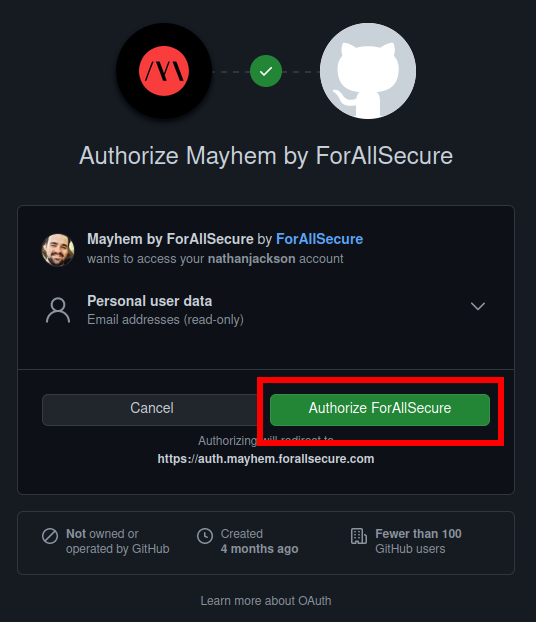
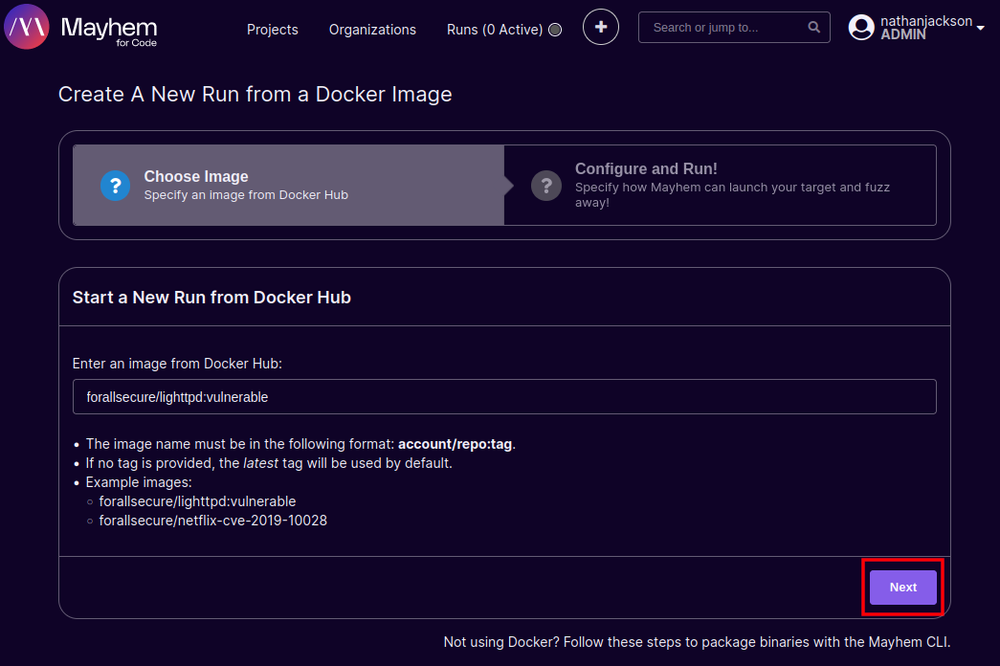
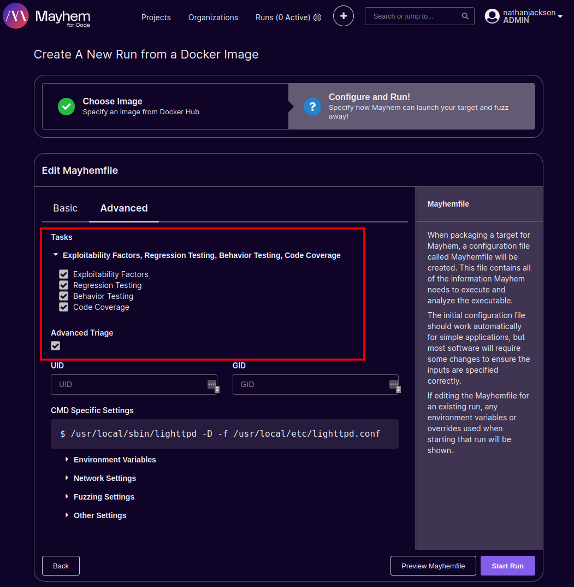
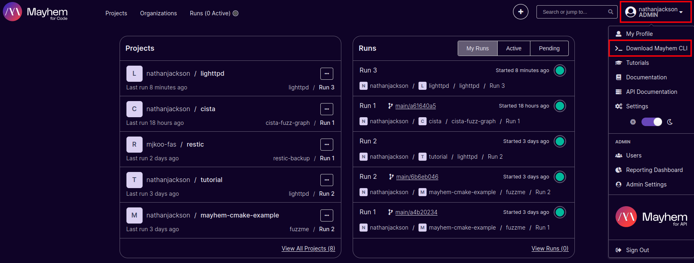

# Lab 1a: Your First Run

## Overview

This guide will show you how to get started with Mayhem using the web interface.

**Time to complete**: About 5 minutes

## Step 1. Create a Mayhem account

Create a new account by navigating to [mayhem.forallsecure.com](https://mayhem.forallsecure.com) and select sign in with GitHub:


On the GitHub sign in page, enter your GitHub credentials or click Create an account:


If you're creating a new GitHub account, follow the onscreen instructions.

In either case, if you're creating a new account or logging in with an existing account, you should eventually be prompted to authorize Mayhem. Click "Authorize ForAllSecure".



## Step 2. Create a new Run

Let's reproduce an exploit for [lighttpd](https://www.lighttpd.net/)! (version
1.4.15, to be specific).

   * Create a new project by clicking the "plus" icon at the top of the screen.

   * On the Choose Image page, enter the following: `forallsecure/lighttpd:vulnerable`.

   * Once you've entered the image, click Next.



## Step 3. Configure Analysis

There are two tabs of analysis options: Basic and Advanced. We will be configuring three values:
   1. Under **Basic**, set the analysis to run 90 seconds.


   2. Under **Advanced**, enable the **Advanced Triage** option and the **Code Coverage** task. 



   
## Step 4. Click start run!

Click the start run button at the bottom of your screen to begin analysis!


The run will take a few minutes to complete, as analysis and post-analysis
processing need to finish. Once the run completes, the web page should look
similar to this:


Congratulations!

You've just:
  * Learned how to start a new Mayhem analysis job using the web interface.
  * Found your first exploitable bug using Mayhem!
  
# Lab 1b: Run with the Mayhem CLI

## Overview

This guide will show you how to start a run using the Mayhem CLI.

**Time to complete**: About 5 minutes

## Step 1. Install the Mayhem CLI

Before using the Mayhem CLI, you need to install it. Fortunately, Mayhem provides instructions for you.

   * Click on "Download Mayhem CLI"



   * Follow the on-screen instructions.


## Step 2. Log in to Mayhem with the CLI

The `mayhem` CLI authenticates to the Mayhem server using an API token. The API
token can be generated in your profile settings: located in the top-left under your username, then "Settings", then "API Tokens".

   * Open your settings.


   * Select API Tokens.


   * Click "Issue New Token".


   * Enter a name for the Token.


   * Copy the CLI Command.


At this point the entire login command has been copied to your clipboard. Paste this into a terminal window.

The command should look similar to this:
```
mayhem login https://mayhem.forallsecure.com/ <YOUR API KEY>
```

## Step 3. Clone hackathon-resources.

Clone the hackathon-resources repo and change into the lighttpd directory.

```
$ git clone https://github.com/mayhemheroes/hackathon-resources
$ cd hackathon-resources/lighttpd/
```

## Step 4. Start the run with the Mayhem CLI.

For this tutorial, no changes to the Mayhemfile are neccesary. We're starting
the same run as in lab 1a, but this time with the CLI.

```
$ mayhem run .
```

You should see output that looks similar to this:
```
WARNING: corpus is not a file or directory, skipping
Run started: tutorial/lighttpd/2
Run URL: https://training.forallsecure.com:443/nathan/tutorial/lighttpd/2
tutorial/lighttpd/2
```

Note the warning regarding the corpus directory is normal for this tutorial.

Navigate to the Web interface for this run by clicking on the "Run URL" from
the output in the VM's shell.

Like lab 1a, the run may take a few minutes to complete, as analysis and
post-analysis processing need to finish. Once the run completes, the web page
should look similar to this:


Congratulations!

You've just:
  * Learned how to start a new Mayhem analysis job using the CLI.
  * Learned how to find a run in the UI after starting it with the CLI.

<walkthrough-conclusion-trophy></walkthrough-conclusion-trophy>

### Bonus: Step 5. Reproduce the defect locally

Note: this will introduce running a target with Docker, which we will go over in more detail in the next section.

There are different steps for reproducing on Linux vs. macOS. Refer to the Linux and macOS sections respectively for your situation.

#### Linux

The Mayhem run should have produced a crashing input for lighttpd. We can reproduce that crash locally. Download the test cases from the run by running `mayhem sync` in the same directory you ran `mayhem run`:
```
$ mayhem sync . 
```

This would give the output:
```
WARNING: downloading file with sha {sha256} project_slug {project_slug} owner {owner}
Downloaded: Mayhemfile.
Downloading tests.tar:  40.0 KiB |   #                                                                                                                                       | Elapsed Time: 0:00:00 114.8 KiB/s
Extracting tests 14 of 14 |#####################################################################################################################################################################| Time:  0:00:00
Successfully downloaded coverage
Target synced at: '.'.
```

Now if you were to check the files in your directory
```
$ ls 
```
It would show something like
```
block_coverage.drcov  defects  func_coverage.json  line_coverage.lcov  Mayhemfile  tests
```
We see that we have a `defects/` folder and a `tests/` folder. We can test sending our crashing test case (under the defects/ folder) to our vulnerable version of lighttpd. To run this server, simply pass the image name to `docker run`, like so:
```
$ docker run --name lighttpd forallsecure/lighttpd:vulnerable 
```

Will give the output
```
2022-04-15 20:52:14: (log.c.75) server started 
```
Now, if we open another terminal, we can send the crashing test case to our running server. To figure out where the server is, run `docker inspect` (and look for IPAddress):
```
$ docker inspect lighttpd | grep "IPAddress" 
```
This command would point us to the IP Address
```
            "SecondaryIPAddresses": null,
            "IPAddress": "172.17.0.5",
                    "IPAddress": "172.17.0.5",
```
We see that lighttpd is running on `172.17.0.5`...
```
$ ls defects/
```
The output would be: 
```
ba0dbafbd0b787a564635b887f77926ae0b3f979dcc72d30cf7fdb1707581919
```
And `ba0dbafbd0b787a564635b887f77926ae0b3f979dcc72d30cf7fdb1707581919` is the hash for our crashing test case. Now we have the info we need to reproduce the crash. We use netcat (`nc`) to send our crashing test case to our lighttpd server on port 80:
```
$ nc 172.17.0.5 80 < ./tests/ba0dbafbd0b787a564635b887f77926ae0b3f979dcc72d30cf7fdb1707581919
```
If we switch back to the first terminal, we should see... nothing. The server is no longer running (it crashed!)
```
$ docker run --name lighttpd forallsecure/lighttpd:vulnerable 
```
The output would be: 
```
2022-04-15 20:52:14: (log.c.75) server started 
                                                                                                                   SEGV ✘ 
```

Congratulations! You've reproduced your first defect!

#### macOS

Due to limitations with Docker for Mac, we have separate instructions to demonstrate reproducing the lighttpd vulnerability.

```
$ mayhem sync . 
```

```
WARNING: downloading file with sha {sha256} project_slug {project_slug} owner {owner}
Downloaded: Mayhemfile.
Downloading tests.tar:  40.0 KiB |   #                                                                                                                                       | Elapsed Time: 0:00:00 114.8 KiB/s
Extracting tests 14 of 14 |#####################################################################################################################################################################| Time:  0:00:00
Successfully downloaded coverage
Target synced at: '.'.
```

```
$ ls 
```

```
block_coverage.drcov  defects  func_coverage.json  line_coverage.lcov  Mayhemfile  tests
```

Start a bash shell inside the container:

```
$ docker run --name lighttpd -it -v $PWD:/lighttpd forallsecure/lighttpd:vulnerable bash
```

Launch lighttpd inside the container:
```
$ /usr/local/sbin/lighttpd -D -f /usr/local/etc/lighttpd.conf
```

In another terminal window, enter the same container with another bash shell:
```
$ docker exec -it lighttpd bash
```

In the second bash shell, install netcat:
```
$ apt-get update && apt-get install -y netcat
```

Send the payload to the running lighttpd server:
```
$ nc 127.0.0.1 80 < /lighttpd/tests/ba0dbafbd0b787a564635b887f77926ae0b3f979dcc72d30cf7fdb1707581919
```

You should see in the first terminal window that lighttpd crashed!

